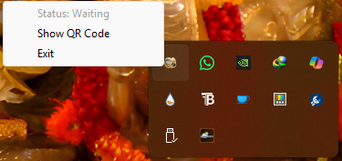
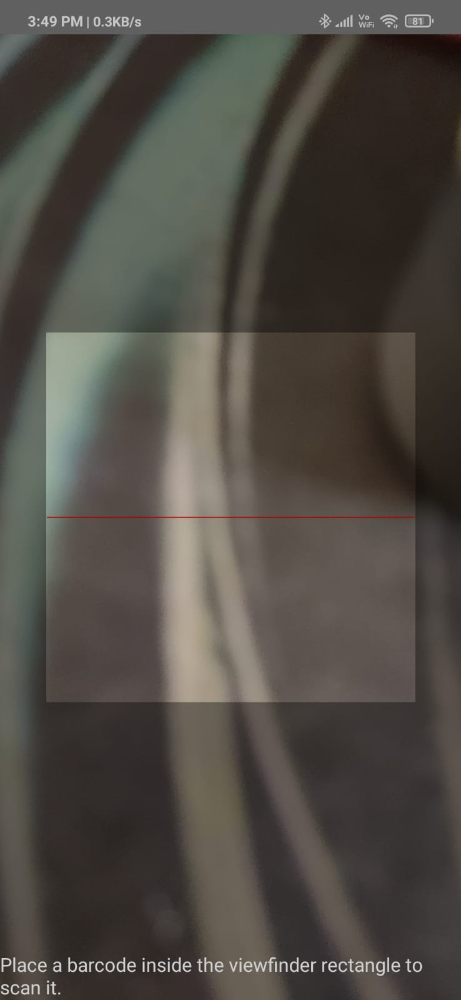

# 🖥️📱 Wireless App PC Controller

Wireless App PC Controller is a smart system that allows you to **control your PC using your mobile phone**.  
It works like a **remote mouse, keyboard, and touchpad** using a QR-based connection over WiFi.

---

## 🚀 Features

- 📡 Wireless connection between PC & Mobile  
- 🔐 Secure pairing using QR Code  
- 🖱️ Use phone as **touchpad (mouse control)**  
- ⌨️ Send keyboard inputs (type from mobile)  
- 📷 Easy connection via QR scan  
- ⚡ Fast and lightweight system  
- 🌐 Works on same WiFi network  

---

## 📸 Screenshots

### 🖥️ PC QR Code (Connection)
<p align="center">
  
</p>

### 🖥️ PC Tray Menu
<p align="center">
  
</p>

### 📱 QR Scanner (Mobile)
<p align="center">
  
</p>

### 📱 Mobile Controller UI
<p align="center">
  
</p>

---

## 🧠 How It Works

1. Run the PC application  
2. Click **"Show QR Code"**  
3. Open mobile app and scan QR  
4. Connection is established  
5. Start controlling your PC from phone  

---

## 🔗 QR Format

The QR contains:

```text
IP_ADDRESS:PORT:TOKEN
